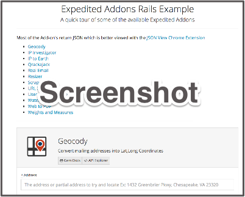

# Expedited Add-ons Alpha App
## Thanks for doing this

This app will help you add the Expedited Addons to a new Heroku instance. After you have set everything up, the homepage of your new app will be populated with a series of forms to play around with the API/Add-ons.

<center>

</center>


## Step 1

Clone this to your local dev machine

## Step 2 

Provision a new Heroku App, the free app tier is more than sufficient for this.

```
heroku create
```

## Step 3 

Copy and Paste the below to your Terminal, it should each of the add-ons in turn. 

All addons are set to add the 'test' plan which is free. 

```
heroku addons:create weightsandmeasures:test
heroku addons:create ipinvestigator:test
heroku addons:create resizer:test
heroku addons:create urlxray:test
heroku addons:create watermarker:test
heroku addons:create iptoearth:test
heroku addons:create qrackajack:test
heroku addons:create useragentidentifier:test
heroku addons:create webtopdf:test
heroku addons:create geocody:test
heroku addons:create realemail:test
heroku addons:create scrapetastic:test
```

## Step 4 

With your web browser, browse to the homepage of your new app. It will be a url like `https://ocean-3403.herokuapp.com`. From there, please play around with anything that seems interesting. 

## Step 5 

Any weirdness, confusion, suggestions, please email me at mike@expeditedaddons.com

## Step 6 

Thanks again for doing this, much *much* appreciated.